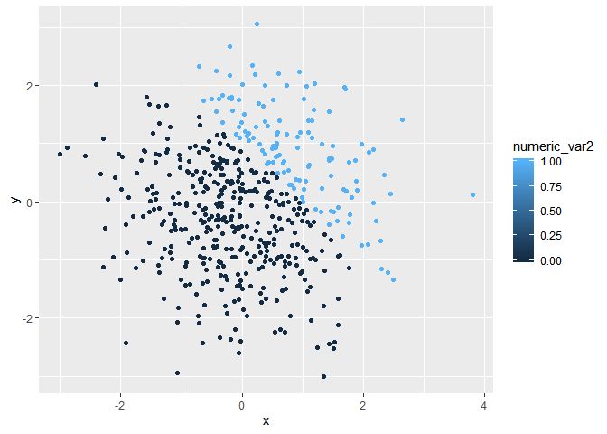

P8105 Homework Assignment 1
================
Kylie Wheelock Riley
9/15/2019

# Problem 1

## Creating the dataframe

``` r
###Setting the seed, so problem 1 random normal distribution stays the same
set.seed(1)

prob1_df = tibble(
  normal_var = rnorm(8),
  logical_var = normal_var > 0,
  charac_var = c("R", "is", "the", "best", "coding", "language", "ever", "!"),  
  factor_var = factor(c("negative", "low", "negative", "high", "low", "negative", "low", "low"))
)
```

## Testing means of the variables in the dataframe

``` r
mean(pull(prob1_df, normal_var))
```

    ## [1] 0.1314544

``` r
mean(pull(prob1_df, logical_var))
```

    ## [1] 0.625

``` r
mean(pull(prob1_df, charac_var))
```

    ## [1] NA

``` r
mean(pull(prob1_df, factor_var))
```

    ## [1] NA

After taking the means of the variables in the dataframe, the numeric
and logical variables generated means. Both the character and factor
variables returned NA for the mean.

## Using as.numeric

``` r
as.numeric(pull(prob1_df, logical_var))
as.numeric(pull(prob1_df, charac_var))
as.numeric(pull(prob1_df, factor_var))
```

After using the as.numeric function, both the logical and factor
variables were converted to numerics. The logical variable contained
True and False statements statements that were converted to “1” and “0”
respectively. The factor variable contained the levels of Negative, Low,
and High which were converted to “3”, “2”, and “1”, respectively. The
character variable was not converted into a numeric. There is no level
or binary structure that can be assigned to the character variable, so
it was not converted. This demonstrates why the character variable was
not able to generate a mean, and why the logical variable did not have a
mean originally, but would could after being converted to a numeric
variable.

## Converting vectors and multiplying

``` r
##convert the logical vector to numeric, and multiply the random sample by the result
as.numeric(pull(prob1_df, logical_var))*(pull(prob1_df, normal_var))
```

    ## [1] 0.0000000 0.1836433 0.0000000 1.5952808 0.3295078 0.0000000 0.4874291
    ## [8] 0.7383247

``` r
##convert the logical vector to a factor, and multiply the random sample by the result
as.factor(pull(prob1_df, logical_var))*(pull(prob1_df, normal_var)) 
```

    ## [1] NA NA NA NA NA NA NA NA

``` r
##convert the logical vector to a factor and then convert the result to numeric, and multiply the random sample by the result
as.numeric(as.factor(pull(prob1_df, logical_var)))*(pull(prob1_df, normal_var))
```

    ## [1] -0.6264538  0.3672866 -0.8356286  3.1905616  0.6590155 -0.8204684
    ## [7]  0.9748581  1.4766494

Converting a logical vector into a factor does not allow you to multiply
it by a numeric, it needs to be converted from logical to factor and
then to numeric.

# Problem 2

## Creating the dataframe

``` r
prob2_df = tibble(
  x = rnorm(500),
  y = rnorm(500),
  logical_var2 = (x + y > 1),
  numeric_var2 = as.numeric(logical_var2),
  factor_var2 = as.factor(logical_var2),
)
```

The dataset above has 500 rows and 5 columns. Variable x has a **mean**
of 0.02, a **median** of -0.04, and a **standard deviation** of 1.01.
The proportion of cases in which x + y \> 1 is
16.59%.

## Scatterplots

<!-- --><!-- --><!-- -->
